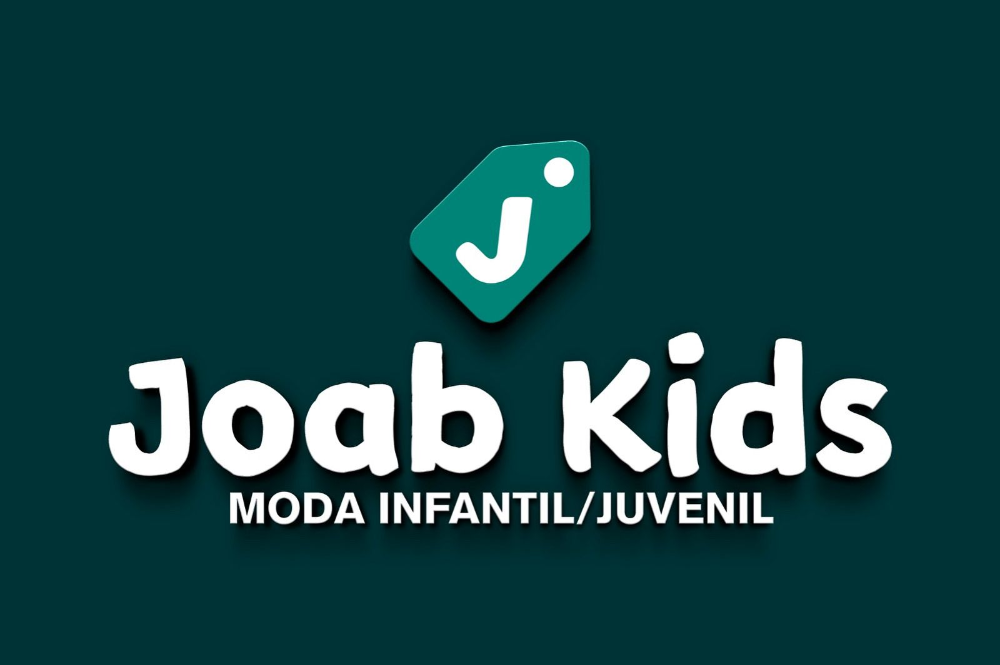

<div align="center">
  

  <h1>Joab Kids Market</h1>

  <p>E-commerce de roupas e calçados infantis — do Instagram para a web.</p>

  
  
  
  
</div>

---

## Sobre o projeto

A **Joab Kids** é uma loja física de roupas e calçados infantis localizada em Canindé, Ceará, que hoje realiza suas vendas principalmente pelo Instagram e WhatsApp. Este projeto tem como objetivo digitalizar esse processo, criando uma plataforma de e-commerce completa para ampliar o alcance da loja e oferecer uma experiência de compra mais organizada para os clientes.

---

## Funcionalidades previstas

### Para clientes
- Cadastro e login de usuário
- Catálogo de produtos com filtros por categoria, tamanho e faixa etária
- Página de detalhe do produto (fotos, descrição, tamanhos disponíveis)
- Carrinho de compras com cálculo do total
- Resumo e histórico de pedidos

### Para administradores
- CRUD de produtos (nome, categoria, preço, estoque, imagens)
- Gerenciamento de pedidos
- Gerenciamento de usuários
- Painel com métricas básicas

---

## Status atual

| Funcionalidade | Status |
|---|---|
| Header com navegação | ✅ Concluído |
| Banner com carrossel de categorias | ✅ Concluído |
| Footer com redes sociais e endereço | ✅ Concluído |
| Roteamento entre páginas | ✅ Configurado |
| Catálogo de produtos | 🔧 Em desenvolvimento |
| Página de produto | 🔧 Em desenvolvimento |
| Carrinho de compras | 🔧 Em desenvolvimento |
| Login e cadastro | 🔧 Em desenvolvimento |
| Backend (API REST) | ⏳ Não iniciado |
| Banco de dados | ⏳ Não iniciado |
| Autenticação JWT | ⏳ Não iniciado |

---

## Stack tecnológica

| Camada | Tecnologia |
|---|---|
| Frontend | React 19 + Vite |
| UI / Estilização | Bootstrap 5 + React Bootstrap |
| Roteamento | React Router DOM v7 |
| Ícones | React Icons |
| Backend (planejado) | Node.js + Express |
| Autenticação (planejado) | JWT |
| Banco de dados (planejado) | A definir |

---

## Como rodar localmente

**Pré-requisitos:** Node.js instalado ([nodejs.org](https://nodejs.org))

```bash
# 1. Clone o repositório
git clone https://github.com/lefitano/JoabKids-Market.git

# 2. Acesse a pasta do frontend
cd JoabKids-Market/frontend

# 3. Instale as dependências
npm install

# 4. Inicie o servidor de desenvolvimento
npm run dev
```

Acesse `http://localhost:5173` no navegador.

---

## Estrutura do projeto

```
JoabKids/
├── backend/                  # API REST (em breve)
├── docs/                     # Documentação do projeto
│   ├── visaogeral.MD
│   └── guia-iniciante.md
└── frontend/
    └── src/
        ├── assets/           # Imagens e logos
        ├── components/      # Componentes reutilizáveis
        │   ├── Categorias.jsx
        │   ├── Header.jsx
        │   ├── Banner.jsx
        │   ├── Footer.jsx
        │   └── ProductCard.jsx
        ├── pages/            # Páginas da aplicação
        │   ├── Home.jsx
        │   ├── Catalogo.jsx
        │   ├── Produto.jsx
        │   ├── Carrinho.jsx
        │   ├── Login.jsx
        │   └── Cadastro.jsx
        └── css/              # Estilos por componente
```

---

## Desenvolvedores

Projeto desenvolvido como parte da digitalização da loja **Joab Kids**.

- **Leonardo Monteiro**
- **Marcio Reis**
- **Ygor Pradoo**
- **Saulo Ribeiro**
- **Rafael Lira**

---

## Contato da loja

- Instagram: [@Joab Kids](https://instagram.com)
- Endereço: Rua Romeu Martins, 99 — Canindé, Ceará

---

<div align="center">
  <sub>Projeto em desenvolvimento ativo.</sub>
</div>
